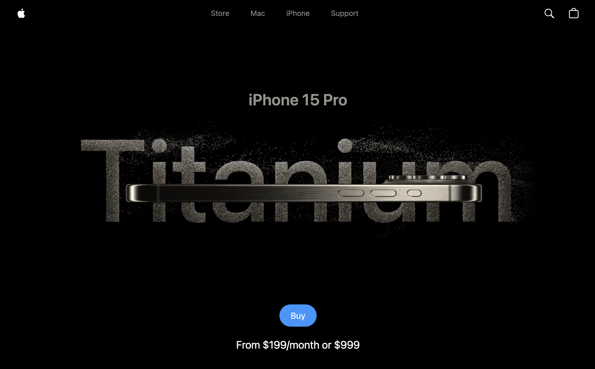
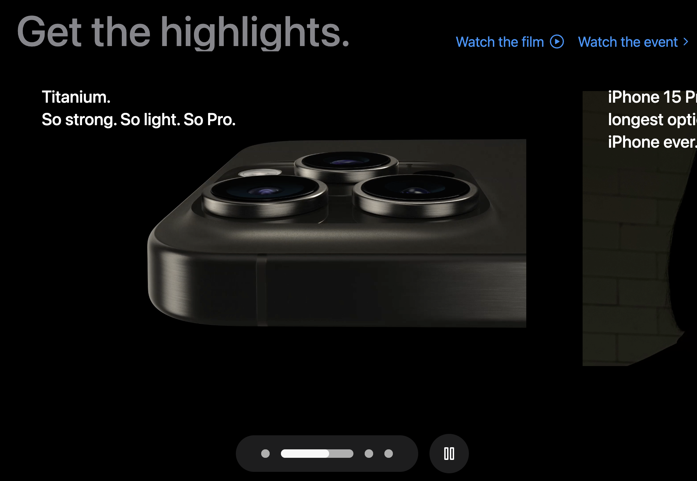
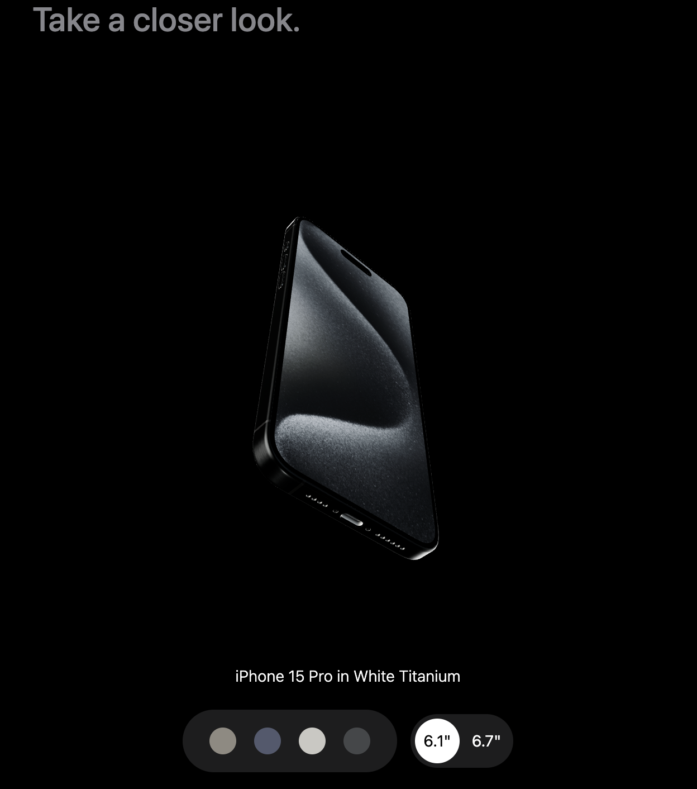

# Apple Website Clone

A clone of the Apple website built using modern web technologies such as **JavaScript**, **GSAP**, **ReactJS**, **TailwindCSS**, and **ThreeJS**. This project replicates the sleek and interactive design of the Apple website, showcasing animations, responsive layouts, and 3D visual elements.

## Features

- **Dynamic Animations**: Powered by GSAP for smooth and engaging transitions.
- **3D Graphics**: Created using ThreeJS for an immersive user experience, including an interactive iPhone viewer where users can rotate the iPhone, view different colors, and explore various models.
- **Responsive Design**: Styled with TailwindCSS to ensure compatibility across all devices.
- **Component-Based Architecture**: Built with ReactJS for modular and reusable components.

## Demo


*Homepage*


*Product Section*


*3D Animation*

## Technologies Used

- **ReactJS**: For building the user interface.
- **TailwindCSS**: For styling and responsive design.
- **GSAP (GreenSock Animation Platform)**: For smooth animations.
- **ThreeJS**: For rendering 3D graphics.
- **JavaScript**: Core programming language.

## Installation

Follow these steps to set up the project locally:

### Prerequisites

Ensure you have the following installed:
- Node.js (v16 or higher)
- npm or yarn

### Steps

1. Clone the repository:
   ```bash
   git clone https://github.com/hrishikasamani/apple-website-clone.git
   ```

2. Navigate to the project directory:
   ```bash
   cd apple-website-clone
   ```

3. Install dependencies:
   ```bash
   npm install
   ```
   Or if you use yarn:
   ```bash
   yarn install
   ```

4. Start the development server:
   ```bash
   npm run dev
   ```
   Or with yarn:
   ```bash
   yarn run dev
   ```

5. Open your browser and navigate to:
   ```
   http://localhost:3000
   ```
   The link to localhost may differ, ensure you check the terminal and follow the link that is displayed.

## Contributing

Contributions are welcome! Feel free to open an issue or submit a pull request if you have any suggestions or improvements.


## Acknowledgments

- Apple for their inspiring design.
- JavaScirpt Mastery for teaching these concepts in a very smooth fashion.
- The creators of ReactJS, TailwindCSS, GSAP, and ThreeJS for their incredible tools.
